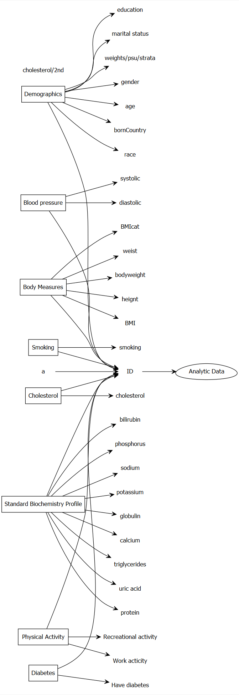

```{r setup, include=FALSE}
knitr::opts_chunk$set(echo = TRUE)
require(SASxport)
require(DiagrammeR)
require(DiagrammeRsvg)
require(rsvg)
library(magrittr)
library(svglite)
library(png)
require(nhanesA)
require(survey)
require(Publish)
require(jtools)
```

Steps for creating Analytic dataset:

```{r graph1ttt, echo=FALSE, cache=TRUE}
g2 <- grViz("
	digraph causal {
	
	  # Nodes
    node [shape = box]
    # node [shape = circle]
    d [label = 'Demographics']
    b [label = 'Blood pressure']
    bm [label = 'Body Measures'] 
    s [label = 'Smoking']
    c [label = 'Cholesterol']
    t [label = 'Standard Biochemistry Profile']
    p [label = 'Physical Activity']
    dd [label = 'Diabetes']

    node [shape = egg]
    ad [label = 'Analytic Data']

    node [shape = plaintext]
    d0 [label = 'ID']
    d1 [label = 'gender']
    d2 [label = 'age']
    d3 [label = 'bornCountry']
    d4 [label = 'race']
    d5 [label = 'education']
    d6 [label = 'marital status']
    d7 [label = 'weights/psu/strata']

    b1 [label = 'diastolic']
    b2 [label = 'systolic']
    
    bm1 [label = 'bodyweight']
    bm2 [label = 'heignt']
    bm3 [label = 'BMI']
    bm4 [label = 'BMIcat']
    bm5 [label = 'weist']

    s1 [label = 'smoking']

    c1 [label = 'cholesterol']

    t1 [label = 'triglycerides']
    t2 [label = 'uric acid']
    t3 [label = 'protein']
    t4 [label = 'bilirubin']
    t5 [label = 'phosphorus']
    t6 [label = 'sodium']
    t7 [label = 'potassium']
    t8 [label = 'globulin']
    t9 [label = 'calcium']

    dd1 [label = 'Have diabetes']

    p1 [label = 'Work acticity']
    p2 [label = 'Recreational activity']
	  
	  # Edges
	  edge [color = black,
	        arrowhead = vee]
	  rankdir = LR
    d -> {d1 d2 d3 d4 d5 d6 d7}
    b -> {b1 b2}
    bm -> {bm1 bm2 bm3 bm4 bm4 bm5}
    dd -> dd1
    p -> {p1 p2}
    s -> {s1}
    c -> {c1}
    t -> {t1 t2 t3 t4 t5 t6 t7 t8 t9}
    {d b bm s a c t dd p} -> d0
    d0 -> ad

	  # Graph
	  graph [overlap = true, fontsize = 10]
	}")
g2 %>% export_svg %>% charToRaw %>% rsvg %>% png::writePNG("images/overallnhanesplan.png")
```

```{r graph1xttt, echo=FALSE, out.width = '65%'}
 
```

# Searching for useful variables and datasets

Load the package to download NHANES data

```{r search, eval=TRUE, cache=TRUE}
library(nhanesA)
```

# Download and Subsetting to retain only the useful variables

Search literature for the relevant variables (e.g., @peters2014combined) and then see if some of them are available in the NHANES data.

```{r search4, eval=TRUE, cache=TRUE}
demo <- nhanes('DEMO_J') # Both males and females 0 YEARS - 150 YEARS
demo <- demo[c("SEQN", # Respondent sequence number
                 "RIAGENDR", # gender
                 "RIDAGEYR", # Age in years at screening
                 "DMDBORN4", # Country of birth
                 "RIDRETH3", # Race/Hispanic origin w/ NH Asian
                 "DMDEDUC3", # Education level - Children/Youth 6-19
                 "DMDEDUC2", # Education level - Adults 20+
                 "DMDMARTL", # Marital status: 20 YEARS - 150 YEARS
                 "INDHHIN2", # Total household income
                 "WTMEC2YR", "SDMVPSU", "SDMVSTRA")]
demo_vars <- names(demo) # nhanesTableVars('DEMO', 'DEMO_J', namesonly=TRUE)
demo1 <- nhanesTranslate('DEMO_J', demo_vars, data=demo)
```

```{r search5, eval=TRUE, cache=TRUE}
bpx <- nhanes('BPX_J')
bpx <- bpx[c("SEQN", # Respondent sequence number
             "BPXDI1", #Diastolic: Blood pres (1st rdg) mm Hg
             "BPXSY1" # Systolic: Blood pres (1st rdg) mm Hg
             )]
bpx_vars <- names(bpx) 
bpx1 <- nhanesTranslate('BPX_J', bpx_vars, data=bpx)
```

```{r search5a, eval=TRUE, cache=TRUE}
bmi <- nhanes('BMX_J')
bmi <- bmi[c("SEQN", # Respondent sequence number
               "BMXWT", # Weight (kg) 
               "BMXHT", # Standing Height (cm)
               "BMXBMI", # Body Mass Index (kg/m**2): 2 YEARS - 150 YEARS
               #"BMDBMIC", # BMI Category - Children/Youth # 2 YEARS - 19 YEARS
               "BMXWAIST" # Waist Circumference (cm): 2 YEARS - 150 YEARS
               )]
bmi_vars <- names(bmi) 
bmi1 <- nhanesTranslate('BMX_J', bmi_vars, data=bmi)
```

```{r search5b, eval=TRUE, cache=TRUE}
smq <- nhanes('SMQ_J')
smq <- smq[c("SEQN", # Respondent sequence number
               "SMQ040" # Do you now smoke cigarettes?: 18 YEARS - 150 YEARS
               )]
smq_vars <- names(smq) 
smq1 <- nhanesTranslate('SMQ_J', smq_vars, data=smq)
```

```{r search5c, eval=TRUE, cache=TRUE}
# alq <- nhanes('ALQ_J')
# alq <- alq[c("SEQN", # Respondent sequence number
#                "ALQ130" # Avg # alcoholic drinks/day - past 12 mos
#                # 18 YEARS - 150 YEARS
#                )]
# alq_vars <- names(alq) 
# alq1 <- nhanesTranslate('ALQ_J', alq_vars, data=alq)
```

```{r search5d, eval=TRUE, cache=TRUE}
chl <- nhanes('TCHOL_J') # 6 YEARS - 150 YEARS
chl <- chl[c("SEQN", # Respondent sequence number
               "LBXTC", # Total Cholesterol (mg/dL)
               "LBDTCSI" # Total Cholesterol (mmol/L)
               )]
chl_vars <- names(chl) 
chl1 <- nhanesTranslate('TCHOL_J', chl_vars, data=chl)
```

```{r search5e, eval=TRUE, cache=TRUE}
tri <- nhanes('BIOPRO_J') # 12 YEARS - 150 YEARS
tri <- tri[c("SEQN", # Respondent sequence number
               "LBXSTR", # Triglycerides, refrig serum (mg/dL)
               "LBXSUA", # Uric acid
               "LBXSTP", # total Protein (g/dL)
               "LBXSTB", # Total Bilirubin (mg/dL)
               "LBXSPH", # Phosphorus (mg/dL)
               "LBXSNASI", # Sodium (mmol/L)
               "LBXSKSI", # Potassium (mmol/L)
               "LBXSGB", # Globulin (g/dL)
               "LBXSCA" # Total Calcium (mg/dL)
               )]
tri_vars <- names(tri) 
tri1 <- nhanesTranslate('BIOPRO_J', tri_vars, data=tri)
```

```{r search5f, eval=TRUE, cache=TRUE}
paq <- nhanes('PAQ_J')
paq <- paq[c("SEQN", # Respondent sequence number
               "PAQ605", # Vigorous work activity 
               "PAQ650" # Vigorous recreational activities
               )]
paq_vars <- names(paq) 
paq1 <- nhanesTranslate('PAQ_J', paq_vars, data=paq)
```

```{r search5g, eval=TRUE, cache=TRUE}
diq <- nhanes('DIQ_J')
diq <- diq[c("SEQN", # Respondent sequence number
               "DIQ010" # Doctor told you have diabetes
               )]
diq_vars <- names(diq) 
diq1 <- nhanesTranslate('DIQ_J', diq_vars, data=diq)
```

# Merging all the datasets

```{r search8, eval=TRUE, cache=TRUE}
analytic.data7 <- Reduce(function(x,y) merge(x,y,by="SEQN",all=TRUE) ,
       list(demo1,bpx1,bmi1,smq1,chl1,tri1,paq1,diq1))
dim(analytic.data7)
```


```{r search8b4g, eval=TRUE, cache=TRUE}
# dim(demo1)
# dim(bpx1)
# analytic.data0 <- merge(demo1, bpx1, by = c("SEQN"), all=TRUE)
# dim(analytic.data0)
# analytic.data1 <- merge(analytic.data0, bmi1, by = c("SEQN"), all=TRUE)
# dim(analytic.data1)
# analytic.data2 <- merge(analytic.data1, smq1, by = c("SEQN"), all=TRUE)
# dim(analytic.data2)
# analytic.data3 <- merge(analytic.data2, alq1, by = c("SEQN"), all=TRUE)
# dim(analytic.data3)
# analytic.data4 <- merge(analytic.data3, chl1, by = c("SEQN"), all=TRUE)
# dim(analytic.data4)
# analytic.data5 <- merge(analytic.data4, tri1, by = c("SEQN"), all=TRUE)
# dim(analytic.data5)
# analytic.data6 <- merge(analytic.data5, paq1, by = c("SEQN"), all=TRUE)
# dim(analytic.data6)
# analytic.data7 <- merge(analytic.data6, diq1, by = c("SEQN"), all=TRUE)
# dim(analytic.data7)
```

# Check Target population and avoid zero-cell cross-tabulation

See that marital status variable was restricted to 20 YEARS - 150 YEARS.

```{r see1, eval=TRUE, cache=TRUE}
str(analytic.data7)
head(analytic.data7)
summary(analytic.data7$RIDAGEYR)
```

```{r subset1, eval=TRUE, cache=TRUE}
dim(analytic.data7)
analytic.data8 <- analytic.data7
analytic.data8$RIDAGEYR[analytic.data8$RIDAGEYR < 20] <- NA
#analytic.data8 <- subset(analytic.data7, RIDAGEYR >= 20)
dim(analytic.data8)
```

Get rid of variables where target was less than 20 years of age accordingly.

```{r subset2, eval=TRUE, cache=TRUE}
analytic.data8$DMDEDUC3 <- NULL # not relevant for adults
#analytic.data8$BMDBMIC <- NULL # not relevant for adults
```

# Get rid of invalid responses

```{r subset3, eval=TRUE, cache=TRUE}
factor.names <- c("RIAGENDR","DMDBORN4","RIDRETH3",
                  "DMDEDUC2","DMDMARTL","INDHHIN2", 
                  "SMQ040", "PAQ605", "PAQ650", "DIQ010")
numeric.names <- c("SEQN","RIDAGEYR","WTMEC2YR",
                   "SDMVPSU", "SDMVSTRA",
                   "BPXDI1", "BPXSY1", "BMXWT", "BMXHT",
                   "BMXBMI", "BMXWAIST",
                   "ALQ130", "LBXTC", "LBDTCSI", 
                   "LBXSTR", "LBXSUA", "LBXSTP", "LBXSTB", 
                   "LBXSPH", "LBXSNASI", "LBXSKSI",
                   "LBXSGB","LBXSCA")
analytic.data8[factor.names] <- apply(X = analytic.data8[factor.names], 
                                      MARGIN = 2, FUN = as.factor)
# analytic.data8[numeric.names] <- apply(X = analytic.data8[numeric.names], 
#                                        MARGIN = 2, FUN = 
#                                          function (x) as.numeric(as.character(x)))
```


```{r subset3x, eval=TRUE, cache=TRUE}
analytic.data9 <- analytic.data8
analytic.data9$DMDBORN4[analytic.data9$DMDBORN4 == "Don't Know"] <- NA
#analytic.data9 <- subset(analytic.data8, DMDBORN4 != "Don't Know")
dim(analytic.data9)

analytic.data10 <- analytic.data9
analytic.data10$DMDEDUC2[analytic.data10$DMDEDUC2 == "Don't Know"] <- NA
#analytic.data10 <- subset(analytic.data9, DMDEDUC2 != "Don't Know")
dim(analytic.data10)

analytic.data11 <- analytic.data10
analytic.data11$DMDMARTL[analytic.data11$DMDMARTL == "Don't Know"] <- NA
analytic.data11$DMDMARTL[analytic.data11$DMDMARTL == "Refused"] <- NA
# analytic.data11 <- subset(analytic.data10, DMDMARTL != "Don't Know" & DMDMARTL != "Refused")
dim(analytic.data11)


analytic.data12 <- analytic.data11
analytic.data12$INDHHIN2[analytic.data12$INDHHIN2 == "Don't Know"] <- NA
analytic.data12$INDHHIN2[analytic.data12$INDHHIN2 == "Refused"] <- NA
analytic.data12$INDHHIN2[analytic.data12$INDHHIN2 == "Under $20,000"] <- NA
analytic.data12$INDHHIN2[analytic.data12$INDHHIN2 == "$20,000 and Over"] <- NA
# analytic.data12 <- subset(analytic.data11, INDHHIN2 != "Don't know" & INDHHIN2 !=  "Refused" & INDHHIN2 != "Under $20,000" & INDHHIN2 != "$20,000 and Over" )
dim(analytic.data12)

#analytic.data11 <- subset(analytic.data10, ALQ130 != 777 & ALQ130 != 999 )
#dim(analytic.data11) # this are listed as NA anyway

analytic.data13 <- analytic.data12
analytic.data13$PAQ605[analytic.data13$PAQ605 == "Don't know"] <- NA
analytic.data13$PAQ605[analytic.data13$PAQ605 == "Refused"] <- NA
# analytic.data13 <- subset(analytic.data12, PAQ605 != "Don't know" & PAQ605 != "Refused")
dim(analytic.data13)

analytic.data14 <- analytic.data13
analytic.data14$PAQ650[analytic.data14$PAQ650 == "Don't know"] <- NA
analytic.data14$PAQ650[analytic.data14$PAQ650 == "Refused"] <- NA
# analytic.data14 <- subset(analytic.data13, PAQ650 != "Don't Know" & PAQ650 != "Refused")
dim(analytic.data14)

analytic.data15 <- analytic.data14
analytic.data15$DIQ010[analytic.data15$DIQ010 == "Don't know"] <- NA
analytic.data15$DIQ010[analytic.data15$DIQ010 == "Refused"] <- NA
# analytic.data15 <- subset(analytic.data14, DIQ010 != "Don't Know" & DIQ010 != "Refused")
dim(analytic.data15)


# analytic.data15$ALQ130[analytic.data15$ALQ130 > 100] <- NA
# summary(analytic.data15$ALQ130)
table(analytic.data15$SMQ040,useNA = "always")
table(analytic.data15$PAQ605,useNA = "always")
table(analytic.data15$PAQ650,useNA = "always")
table(analytic.data15$PAQ650,useNA = "always")
```

# Recode values

```{r subset4, eval=TRUE, cache=TRUE}
require(car)
analytic.data15$RIDRETH3 <- recode(analytic.data15$RIDRETH3, 
                            "c('Mexican American','Other Hispanic')='Hispanic'; 
                            'Non-Hispanic White'='White'; 
                            'Non-Hispanic Black'='Black';
                            c('Non-Hispanic Asian',
                               'Other Race - Including Multi-Rac')='Other';
	                           else=NA")
analytic.data15$DMDEDUC2 <- recode(analytic.data15$DMDEDUC2, 
                            "c('Some college or AA degree',
                             'College graduate or above')='College'; 
                            c('9-11th grade (Includes 12th grad', 
                              'High school graduate/GED or equi')
                               ='High.School'; 
                            'Less than 9th grade'='School';
	                           else=NA")
analytic.data15$DMDMARTL <- recode(analytic.data15$DMDMARTL, 
                            "c('Divorced','Separated','Widowed')
                                ='Previously.married'; 
                            c('Living with partner', 'Married')
                                ='Married'; 
                            'Never married'='Never.married';
	                           else=NA")
analytic.data15$INDHHIN2 <- recode(analytic.data15$INDHHIN2, 
                            "c('$ 0 to $ 4,999', '$ 5,000 to $ 9,999', 
                                 '$10,000 to $14,999', '$15,000 to $19,999', 
                                 '$20,000 to $24,999')='<25k';
                            c('$25,000 to $34,999', '$35,000 to $44,999', 
                                 '$45,000 to $54,999') = 'Between.25kto54k';
                            c('$55,000 to $64,999', '$65,000 to $74,999',
                                 '$75,000 to $99,999')='Between.55kto99k';
                            '$100,000 and Over'= 'Over100k';
	                           else=NA")
analytic.data15$SMQ040 <- recode(analytic.data15$SMQ040, 
                            "'Every day'='Every.day';
                            'Not at all'='Not.at.all';
                            'Some days'='Some.days';
	                           else=NA")
analytic.data15$DIQ010 <- recode(analytic.data15$DIQ010, 
                            "'No'='No';
                            c('Yes', 'Borderline')='Yes';
	                           else=NA")
```

# Check missingness

```{r missing1, eval=TRUE, cache=TRUE}
require(DataExplorer)
plot_missing(analytic.data15)
```

# Check data summaries

```{r analytic0, eval=TRUE, cache=TRUE}
# below is to fix issues with R 3.5.1
# assignInNamespace("[.labelled", Hmisc:::"[.labelled", asNamespace("haven"))
names(analytic.data15)
names(analytic.data15) <- c("ID", "gender", "age", "born", "race", "education", 
"married", "income", "weight", "psu", "strata", "diastolicBP", 
"systolicBP", "bodyweight", "bodyheight", "bmi", "waist", "smoke", 
"cholesterol", "cholesterolM2", "triglycerides", 
"uric.acid", "protein", "bilirubin", "phosphorus", "sodium", 
"potassium", "globulin", "calcium", "physical.work", 
"physical.recreational","diabetes")
require("tableone")
CreateTableOne(data = analytic.data15, includeNA = TRUE)
```

# Create fictitious data (missing = 'No')

```{r analytic191, eval=TRUE, cache=TRUE}
fictitious.data <- analytic.data15
# the following is the worst possible solution!
fictitious.data$smoke[is.na(fictitious.data$smoke)] <- "Not.at.all"
#fictitious.data$alcohol[is.na(fictitious.data$alcohol)] <- 0
table(fictitious.data$smoke)
#summary(fictitious.data$alcohol)
fictitious.data <- as.data.frame(na.omit(fictitious.data))
dim(fictitious.data)
```

# Create complete case data (for now)

```{r analytic1, eval=TRUE, cache=TRUE}
analytic.with.miss <- analytic.data15
analytic.with.miss$cholesterol.bin <- ifelse(analytic.with.miss$cholesterol <200, 1,0)
analytic <- as.data.frame(na.omit(analytic.with.miss))
dim(analytic)
```

```{r analytic2, eval=TRUE}
# removing values with excessive missing values
# analytic.data15$ALQ130 <- NULL
# analytic1 <- as.data.frame(na.omit(analytic.data15))
# dim(analytic1)
# analytic.data15$smoke <- NULL
# analytic2 <- as.data.frame(na.omit(analytic.data15))
# dim(analytic2)
```

```{r analytic3, eval=TRUE, cache=TRUE}
require("tableone")
CreateTableOne(data = analytic, includeNA = TRUE)
```

# Regression

## Wrong way to define design

[See the section on *Analyzing Subgroups in NHANES*](https://wwwn.cdc.gov/nchs/nhanes/tutorials/module4.aspx)


```{r, cache=TRUE}
w.design.wrong <- svydesign(id=~psu, 
                       strata=~strata, 
                       weights=~weight, 
                      data=analytic, # already subsetted data
                      nest = TRUE)
summary(weights(w.design.wrong))
```

## Wrong analysis

```{r, cache=TRUE}
out.formula <- as.formula(cholesterol.bin ~ diabetes + 
                            gender + race + education + 
                            married + income + age + 
                            diastolicBP + systolicBP + bmi)
fit.wrong <- svyglm(out.formula,
               design = w.design.wrong, 
               family = binomial(logit))
publish(fit.wrong)
```

## Define design and subset

- [See the section on *How to Request Taylor Series Linearization to Calculate Variance in NHANES using R*](https://wwwn.cdc.gov/nchs/nhanes/tutorials/module4.aspx)

```{r, cache=TRUE}
analytic.data <- analytic
analytic.with.miss$miss <- 1
analytic.with.miss$ID[1:10] # full data
analytic.data$ID[1:10] # complete case
analytic.with.miss$ID[analytic.with.miss$ID %in% analytic.data$ID][1:10]
analytic.with.miss$miss[analytic.with.miss$ID %in% analytic.data$ID] <- 0
table(analytic.with.miss$miss)
```


```{r, cache=TRUE}
analytic.with.miss$strata<- as.factor(analytic.with.miss$strata)
analytic.with.miss$psu<- as.factor(analytic.with.miss$psu)
w.design0 <- svydesign(id=~psu, 
                       strata=~strata, 
                       weights=~weight, 
                      data=analytic.with.miss,
                      nest = TRUE)
summary(weights(w.design0))
w.designX <- subset(w.design0, miss == 0)
summary(weights(w.designX))
w.designX$df.residual
names(w.designX)
```
## Regression analysis

```{r, cache=TRUE}
out.formula <- as.formula(cholesterol.bin ~ diabetes + 
                            gender + race + education + 
                            married + income + age)
fit1 <- svyglm(out.formula,
               design = w.designX, 
               family = binomial(logit))
# default = denominator degrees of freedom for Wald tests?
```

```{r}
require(Publish)
# notice that the conclusion from CI.95  p-value are contradictory
# For example: gender/Male OR 1.51 [95% CI: 1.10;2.07] but p-value is 0.1233
publish(fit1)
```

## Regression analysis with more covariates

```{r, cache=TRUE}
out.formula <- as.formula(cholesterol.bin ~ diabetes + 
                            gender + race + education + 
                            married + income + age + 
                            diastolicBP + systolicBP + bmi)
fit1 <- svyglm(out.formula,
               design = w.designX, 
               family = binomial(logit))
# default = denominator degrees of freedom for Wald tests?
```

```{r}
summary(fit1)$coefficients
require(Publish)
publish(fit1)
```

## Current default option

```{r, cache=TRUE}
summary(fit1)$coefficients
```

## Tests based on a Normal distribution 

```{r, cache=TRUE}
# p-value
summary(fit1, df.resid = Inf)
round(summary(fit1, 
              df.resid = Inf)$coefficients[,4] ,3)  
# CI
round(exp(confint(fit1, ddf = Inf)),2)
```

# Residual df = PSUs count - strata count

- [ref: section 3.1](https://projecteuclid.org/download/pdfview_1/euclid.ss/1494489815)
- [See the section on *Degrees of Freedom for Performing Statistical Tests and Calculating Confidence Limits*](https://wwwn.cdc.gov/nchs/nhanes/tutorials/module4.aspx)

```{r, cache=TRUE}
ns <- length(unique(analytic.with.miss$strata)) # number of strata
length(unique(analytic.with.miss$psu)) # number of clusters per strata
nc <- length(unique(analytic.with.miss$strata))*
  length(unique(analytic.with.miss$psu)) # number of clusters in total
nc - ns
degf(w.designX)
# p-value
summary(fit1, df.resid = degf(w.designX))
round(summary(fit1, 
              df.resid = degf(w.designX))$coefficients[,4] ,3)  
# CI
round(exp(confint(fit1, ddf = degf(w.designX))),2)
```

# Saving data

```{r search8save, eval=TRUE}
# getwd()
save(analytic.with.miss, analytic, 
     file="SurveyData/NHANES17.RData")
library(foreign)
write.dta(analytic.with.miss, "SurveyData/analyticm.dta")
```

# Reproducing results in Stata

- [See the section on *How to Request Taylor Series Linearization to Calculate Variance in NHANES using Stata*](https://wwwn.cdc.gov/nchs/nhanes/tutorials/module4.aspx)


```{r stata, eval=FALSE}
use "...\SurveyData\analyticm.dta", clear
svyset psu, strata(strata) weight(weight) vce(linearized) singleunit(missing)

encode diabetes, gen(diabetes2)
encode gender, gen(gender2)
encode race, gen(race2)
encode education, gen(education2)
encode married, gen(married2)
encode income, gen(income2)

svy linearized, subpop(if miss == 0) : logistic cholesterol_bin i.diabetes2 i.gender2 i.race2 i.education2 i.married2 i.income2 age diastolicBP systolicBP bmi

estat effects, deff
```

```{r, eval=FALSE}
. svy linearized, subpop(if miss == 0) : logistic cholesterol_bin i.diabetes2 i.gender2 i.race2 i.education2 i.married2 i.income2 age diastolicBP systolicBP bmi
(running logistic on estimation sample)

Survey: Logistic regression

Number of strata   =        15                Number of obs     =        9,254
Number of PSUs     =        30                Population size   =  320,842,721
                                              Subpop. no. obs   =        1,562
                                              Subpop. size      = 75,817,186.9
                                              Design df         =           15
                                              F(  15,      1)   =            .
                                              Prob > F          =            .

-------------------------------------------------------------------------------------
                    |             Linearized
    cholesterol_bin | Odds Ratio   Std. Err.      t    P>|t|     [95% Conf. Interval]
--------------------+----------------------------------------------------------------
          diabetes2 |
               Yes  |   1.971124   .5113829     2.62   0.019     1.133859    3.426643
                    |
            gender2 |
              Male  |   1.573986   .2523469     2.83   0.013      1.11839    2.215178
                    |
              race2 |
          Hispanic  |   .7721228   .1459105    -1.37   0.191     .5161291    1.155086
             Other  |   .7627556    .156057    -1.32   0.205     .4931685    1.179711
             White  |   .9130792   .2030462    -0.41   0.688     .5684089     1.46675
                    |
         education2 |
       High.School  |   1.124058    .135699     0.97   0.348     .8690377    1.453914
            School  |   .8845209   .2782657    -0.39   0.702     .4523712    1.729503
                    |
           married2 |
     Never.married  |   1.383035   .3609745     1.24   0.233     .7929206    2.412328
Previously.married  |   1.174078   .0904385     2.08   0.055     .9963055     1.38357
                    |
            income2 |
  Between.25kto54k  |   .9308495   .1732257    -0.39   0.706     .6260606    1.384021
  Between.55kto99k  |   .9086205   .2210478    -0.39   0.699     .5409851    1.526088
          Over100k  |   .5808772   .1324302    -2.38   0.031     .3573104    .9443283
                    |
                age |   .9916786   .0060695    -1.37   0.192     .9788258      1.0047
        diastolicBP |   .9889441   .0075542    -1.46   0.166      .972973    1.005177
         systolicBP |   .9888532   .0054738    -2.03   0.061     .9772546    1.000589
                bmi |   .9930232   .0107115    -0.65   0.526     .9704526    1.016119
              _cons |   22.34192   15.59412     4.45   0.000     5.046846    98.90557
-------------------------------------------------------------------------------------
Note: _cons estimates baseline odds.
```
