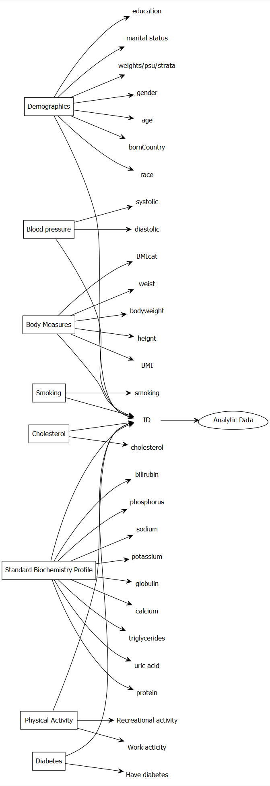

Steps for creating Analytic dataset:




# Searching for useful variables and datasets

Load the package to download NHANES data


```r
library(nhanesA)
```

# Download and Subsetting to retain only the useful variables

Search literature for the relevant variables (e.g., @peters2014combined) and then see if some of them are available in the NHANES data.


```r
demo <- nhanes('DEMO_J') # Both males and females 0 YEARS - 150 YEARS
```

```
## Processing SAS dataset DEMO_J 	 ..
```

```r
demo <- demo[c("SEQN", # Respondent sequence number
                 "RIAGENDR", # gender
                 "RIDAGEYR", # Age in years at screening
                 "DMDBORN4", # Country of birth
                 "RIDRETH3", # Race/Hispanic origin w/ NH Asian
                 "DMDEDUC3", # Education level - Children/Youth 6-19
                 "DMDEDUC2", # Education level - Adults 20+
                 "DMDMARTL", # Marital status: 20 YEARS - 150 YEARS
                 "INDHHIN2", # Total household income
                 "WTMEC2YR", "SDMVPSU", "SDMVSTRA")]
demo_vars <- names(demo) # nhanesTableVars('DEMO', 'DEMO_J', namesonly=TRUE)
demo1 <- nhanesTranslate('DEMO_J', demo_vars, data=demo)
```

```
## Warning in FUN(X[[i]], ...): No translation table is available for SEQN
```

```
## Translated columns: RIAGENDR DMDBORN4 RIDRETH3 DMDEDUC3 DMDEDUC2 DMDMARTL INDHHIN2
```


```r
bpx <- nhanes('BPX_J')
```

```
## Processing SAS dataset BPX_J 	 ..
```

```r
bpx <- bpx[c("SEQN", # Respondent sequence number
             "BPXDI1", #Diastolic: Blood pres (1st rdg) mm Hg
             "BPXSY1" # Systolic: Blood pres (1st rdg) mm Hg
             )]
bpx_vars <- names(bpx) 
bpx1 <- nhanesTranslate('BPX_J', bpx_vars, data=bpx)
```

```
## Warning in FUN(X[[i]], ...): No translation table is available for SEQN
```

```
## Warning in nhanesTranslate("BPX_J", bpx_vars, data = bpx): No columns were
## translated
```


```r
bmi <- nhanes('BMX_J')
```

```
## Processing SAS dataset BMX_J 	 ..
```

```r
bmi <- bmi[c("SEQN", # Respondent sequence number
               "BMXWT", # Weight (kg) 
               "BMXHT", # Standing Height (cm)
               "BMXBMI", # Body Mass Index (kg/m**2): 2 YEARS - 150 YEARS
               #"BMDBMIC", # BMI Category - Children/Youth # 2 YEARS - 19 YEARS
               "BMXWAIST" # Waist Circumference (cm): 2 YEARS - 150 YEARS
               )]
bmi_vars <- names(bmi) 
bmi1 <- nhanesTranslate('BMX_J', bmi_vars, data=bmi)
```

```
## Warning in FUN(X[[i]], ...): No translation table is available for SEQN
```

```
## Warning in nhanesTranslate("BMX_J", bmi_vars, data = bmi): No columns were
## translated
```


```r
smq <- nhanes('SMQ_J')
```

```
## Processing SAS dataset SMQ_J 	 ..
```

```r
smq <- smq[c("SEQN", # Respondent sequence number
               "SMQ040" # Do you now smoke cigarettes?: 18 YEARS - 150 YEARS
               )]
smq_vars <- names(smq) 
smq1 <- nhanesTranslate('SMQ_J', smq_vars, data=smq)
```

```
## Warning in FUN(X[[i]], ...): No translation table is available for SEQN
```

```
## Translated columns: SMQ040
```


```r
# alq <- nhanes('ALQ_J')
# alq <- alq[c("SEQN", # Respondent sequence number
#                "ALQ130" # Avg # alcoholic drinks/day - past 12 mos
#                # 18 YEARS - 150 YEARS
#                )]
# alq_vars <- names(alq) 
# alq1 <- nhanesTranslate('ALQ_J', alq_vars, data=alq)
```


```r
chl <- nhanes('TCHOL_J') # 6 YEARS - 150 YEARS
```

```
## Processing SAS dataset TCHOL_J 	 ..
```

```r
chl <- chl[c("SEQN", # Respondent sequence number
               "LBXTC", # Total Cholesterol (mg/dL)
               "LBDTCSI" # Total Cholesterol (mmol/L)
               )]
chl_vars <- names(chl) 
chl1 <- nhanesTranslate('TCHOL_J', chl_vars, data=chl)
```

```
## Warning in FUN(X[[i]], ...): No translation table is available for SEQN
```

```
## Warning in nhanesTranslate("TCHOL_J", chl_vars, data = chl): No columns were
## translated
```


```r
tri <- nhanes('BIOPRO_J') # 12 YEARS - 150 YEARS
```

```
## Processing SAS dataset BIOPRO_J 	 ..
```

```r
tri <- tri[c("SEQN", # Respondent sequence number
               "LBXSTR", # Triglycerides, refrig serum (mg/dL)
               "LBXSUA", # Uric acid
               "LBXSTP", # total Protein (g/dL)
               "LBXSTB", # Total Bilirubin (mg/dL)
               "LBXSPH", # Phosphorus (mg/dL)
               "LBXSNASI", # Sodium (mmol/L)
               "LBXSKSI", # Potassium (mmol/L)
               "LBXSGB", # Globulin (g/dL)
               "LBXSCA" # Total Calcium (mg/dL)
               )]
tri_vars <- names(tri) 
tri1 <- nhanesTranslate('BIOPRO_J', tri_vars, data=tri)
```

```
## Warning in FUN(X[[i]], ...): No translation table is available for SEQN
```

```
## Warning in nhanesTranslate("BIOPRO_J", tri_vars, data = tri): No columns were
## translated
```


```r
paq <- nhanes('PAQ_J')
```

```
## Processing SAS dataset PAQ_J 	 ..
```

```r
paq <- paq[c("SEQN", # Respondent sequence number
               "PAQ605", # Vigorous work activity 
               "PAQ650" # Vigorous recreational activities
               )]
paq_vars <- names(paq) 
paq1 <- nhanesTranslate('PAQ_J', paq_vars, data=paq)
```

```
## Warning in FUN(X[[i]], ...): No translation table is available for SEQN
```

```
## Translated columns: PAQ605 PAQ650
```


```r
diq <- nhanes('DIQ_J')
```

```
## Processing SAS dataset DIQ_J 	 ..
```

```r
diq <- diq[c("SEQN", # Respondent sequence number
               "DIQ010" # Doctor told you have diabetes
               )]
diq_vars <- names(diq) 
diq1 <- nhanesTranslate('DIQ_J', diq_vars, data=diq)
```

```
## Warning in FUN(X[[i]], ...): No translation table is available for SEQN
```

```
## Translated columns: DIQ010
```

# Merging all the datasets


```r
analytic.data7 <- Reduce(function(x,y) merge(x,y,by="SEQN",all=TRUE) ,
       list(demo1,bpx1,bmi1,smq1,chl1,tri1,paq1,diq1))
dim(analytic.data7)
```

```
## [1] 9254   33
```


```r
# dim(demo1)
# dim(bpx1)
# analytic.data0 <- merge(demo1, bpx1, by = c("SEQN"), all=TRUE)
# dim(analytic.data0)
# analytic.data1 <- merge(analytic.data0, bmi1, by = c("SEQN"), all=TRUE)
# dim(analytic.data1)
# analytic.data2 <- merge(analytic.data1, smq1, by = c("SEQN"), all=TRUE)
# dim(analytic.data2)
# analytic.data3 <- merge(analytic.data2, alq1, by = c("SEQN"), all=TRUE)
# dim(analytic.data3)
# analytic.data4 <- merge(analytic.data3, chl1, by = c("SEQN"), all=TRUE)
# dim(analytic.data4)
# analytic.data5 <- merge(analytic.data4, tri1, by = c("SEQN"), all=TRUE)
# dim(analytic.data5)
# analytic.data6 <- merge(analytic.data5, paq1, by = c("SEQN"), all=TRUE)
# dim(analytic.data6)
# analytic.data7 <- merge(analytic.data6, diq1, by = c("SEQN"), all=TRUE)
# dim(analytic.data7)
```

# Check Target population and avoid zero-cell cross-tabulation

See that marital status variable was restricted to 20 YEARS - 150 YEARS.


```r
str(analytic.data7)
```

```
## 'data.frame':	9254 obs. of  33 variables:
##  $ SEQN    : 'labelled' int  93703 93704 93705 93706 93707 93708 93709 93710 93711 93712 ...
##   ..- attr(*, "label")= chr "Respondent sequence number"
##  $ RIAGENDR: Factor w/ 2 levels "Male","Female": 2 1 2 1 1 2 2 2 1 1 ...
##  $ RIDAGEYR: 'labelled' int  2 2 66 18 13 66 75 0 56 18 ...
##   ..- attr(*, "label")= chr "Age in years at screening"
##  $ DMDBORN4: Factor w/ 4 levels "Born in 50 US states or Washingt",..: 1 1 1 1 1 2 1 1 2 2 ...
##  $ RIDRETH3: Factor w/ 6 levels "Mexican American",..: 5 3 4 5 6 5 4 3 5 1 ...
##  $ DMDEDUC3: Factor w/ 17 levels "Never attended / kindergarten on",..: NA NA NA 16 7 NA NA NA NA 13 ...
##  $ DMDEDUC2: Factor w/ 7 levels "Less than 9th grade",..: NA NA 2 NA NA 1 4 NA 5 NA ...
##  $ DMDMARTL: Factor w/ 7 levels "Married","Widowed",..: NA NA 3 NA NA 1 2 NA 1 NA ...
##  $ INDHHIN2: Factor w/ 16 levels "$ 0 to $ 4,999",..: 14 14 3 NA 10 6 2 14 14 4 ...
##  $ WTMEC2YR: 'labelled' num  8540 42567 8338 8723 7065 ...
##   ..- attr(*, "label")= chr "Full sample 2 year MEC exam weight"
##  $ SDMVPSU : 'labelled' int  2 1 2 2 1 2 1 1 2 2 ...
##   ..- attr(*, "label")= chr "Masked variance pseudo-PSU"
##  $ SDMVSTRA: 'labelled' int  145 143 145 134 138 138 136 134 134 147 ...
##   ..- attr(*, "label")= chr "Masked variance pseudo-stratum"
##  $ BPXDI1  : 'labelled' int  NA NA NA 74 38 NA 66 NA 68 68 ...
##   ..- attr(*, "label")= chr "Diastolic: Blood pres (1st rdg) mm Hg"
##  $ BPXSY1  : 'labelled' int  NA NA NA 112 128 NA 120 NA 108 112 ...
##   ..- attr(*, "label")= chr "Systolic: Blood pres (1st rdg) mm Hg"
##  $ BMXWT   : 'labelled' num  13.7 13.9 79.5 66.3 45.4 53.5 88.8 10.2 62.1 58.9 ...
##   ..- attr(*, "label")= chr "Weight (kg)"
##  $ BMXHT   : 'labelled' num  88.6 94.2 158.3 175.7 158.4 ...
##   ..- attr(*, "label")= chr "Standing Height (cm)"
##  $ BMXBMI  : 'labelled' num  17.5 15.7 31.7 21.5 18.1 23.7 38.9 NA 21.3 19.7 ...
##   ..- attr(*, "label")= chr "Body Mass Index (kg/m**2)"
##  $ BMXWAIST: 'labelled' num  48.2 50 101.8 79.3 64.1 ...
##   ..- attr(*, "label")= chr "Waist Circumference (cm)"
##  $ SMQ040  : Factor w/ 3 levels "Every day","Some days",..: NA NA 3 NA NA NA 1 NA NA 2 ...
##  $ LBXTC   : 'labelled' int  NA NA 157 148 189 209 176 NA 238 182 ...
##   ..- attr(*, "label")= chr "Total Cholesterol (mg/dL)"
##  $ LBDTCSI : 'labelled' num  NA NA 4.06 3.83 4.89 5.4 4.55 NA 6.15 4.71 ...
##   ..- attr(*, "label")= chr "Total Cholesterol (mmol/L)"
##  $ LBXSTR  : 'labelled' int  NA NA 95 92 110 72 132 NA 59 124 ...
##   ..- attr(*, "label")= chr "Triglycerides, refrig serum (mg/dL)"
##  $ LBXSUA  : 'labelled' num  NA NA 5.8 8 5.5 4.5 6.2 NA 4.2 5.8 ...
##   ..- attr(*, "label")= chr "Uric acid (mg/dL)"
##  $ LBXSTP  : 'labelled' num  NA NA 7.3 7.1 8 7.1 7 NA 7.1 8.1 ...
##   ..- attr(*, "label")= chr "Total Protein (g/dL)"
##  $ LBXSTB  : 'labelled' num  NA NA 0.6 0.7 0.7 0.5 0.3 NA 0.3 0.8 ...
##   ..- attr(*, "label")= chr "Total Bilirubin (mg/dL)"
##  $ LBXSPH  : 'labelled' num  NA NA 4 4 4.3 3.3 3.5 NA 3.4 5.1 ...
##   ..- attr(*, "label")= chr "Phosphorus (mg/dL)"
##  $ LBXSNASI: 'labelled' int  NA NA 141 144 137 144 141 NA 140 141 ...
##   ..- attr(*, "label")= chr "Sodium (mmol/L)"
##  $ LBXSKSI : 'labelled' num  NA NA 4 4.4 3.3 4.4 4.1 NA 4.9 4.3 ...
##   ..- attr(*, "label")= chr "Potassium (mmol/L)"
##  $ LBXSGB  : 'labelled' num  NA NA 2.9 2.7 2.8 3.2 3.3 NA 3.1 3.3 ...
##   ..- attr(*, "label")= chr "Globulin (g/dL)"
##  $ LBXSCA  : 'labelled' num  NA NA 9.2 9.6 10.1 9.5 9.9 NA 9.4 9.6 ...
##   ..- attr(*, "label")= chr "Total Calcium (mg/dL)"
##  $ PAQ605  : Factor w/ 3 levels "Yes","No","Don't know": NA NA 2 2 NA 2 2 NA 2 1 ...
##  $ PAQ650  : Factor w/ 2 levels "Yes","No": NA NA 2 2 NA 2 2 NA 1 1 ...
##  $ DIQ010  : Factor w/ 4 levels "Yes","No","Borderline",..: 2 2 2 2 2 3 2 NA 2 2 ...
```

```r
head(analytic.data7)
```

```
##    SEQN RIAGENDR RIDAGEYR                         DMDBORN4
## 1 93703   Female        2 Born in 50 US states or Washingt
## 2 93704     Male        2 Born in 50 US states or Washingt
## 3 93705   Female       66 Born in 50 US states or Washingt
## 4 93706     Male       18 Born in 50 US states or Washingt
## 5 93707     Male       13 Born in 50 US states or Washingt
## 6 93708   Female       66                           Others
##                           RIDRETH3              DMDEDUC3
## 1               Non-Hispanic Asian                  <NA>
## 2               Non-Hispanic White                  <NA>
## 3               Non-Hispanic Black                  <NA>
## 4               Non-Hispanic Asian More than high school
## 5 Other Race - Including Multi-Rac             6th grade
## 6               Non-Hispanic Asian                  <NA>
##                           DMDEDUC2 DMDMARTL           INDHHIN2  WTMEC2YR
## 1                             <NA>     <NA>  $100,000 and Over  8539.731
## 2                             <NA>     <NA>  $100,000 and Over 42566.615
## 3 9-11th grade (Includes 12th grad Divorced $10,000 to $14,999  8338.420
## 4                             <NA>     <NA>               <NA>  8723.440
## 5                             <NA>     <NA> $65,000 to $74,999  7064.610
## 6              Less than 9th grade  Married $25,000 to $34,999 14372.489
##   SDMVPSU SDMVSTRA BPXDI1 BPXSY1 BMXWT BMXHT BMXBMI BMXWAIST     SMQ040 LBXTC
## 1       2      145     NA     NA  13.7  88.6   17.5     48.2       <NA>    NA
## 2       1      143     NA     NA  13.9  94.2   15.7     50.0       <NA>    NA
## 3       2      145     NA     NA  79.5 158.3   31.7    101.8 Not at all   157
## 4       2      134     74    112  66.3 175.7   21.5     79.3       <NA>   148
## 5       1      138     38    128  45.4 158.4   18.1     64.1       <NA>   189
## 6       2      138     NA     NA  53.5 150.2   23.7     88.2       <NA>   209
##   LBDTCSI LBXSTR LBXSUA LBXSTP LBXSTB LBXSPH LBXSNASI LBXSKSI LBXSGB LBXSCA
## 1      NA     NA     NA     NA     NA     NA       NA      NA     NA     NA
## 2      NA     NA     NA     NA     NA     NA       NA      NA     NA     NA
## 3    4.06     95    5.8    7.3    0.6    4.0      141     4.0    2.9    9.2
## 4    3.83     92    8.0    7.1    0.7    4.0      144     4.4    2.7    9.6
## 5    4.89    110    5.5    8.0    0.7    4.3      137     3.3    2.8   10.1
## 6    5.40     72    4.5    7.1    0.5    3.3      144     4.4    3.2    9.5
##   PAQ605 PAQ650     DIQ010
## 1   <NA>   <NA>         No
## 2   <NA>   <NA>         No
## 3     No     No         No
## 4     No     No         No
## 5   <NA>   <NA>         No
## 6     No     No Borderline
```

```r
summary(analytic.data7$RIDAGEYR)
```

```
##    Min. 1st Qu.  Median    Mean 3rd Qu.    Max. 
##    0.00   11.00   31.00   34.33   58.00   80.00
```


```r
dim(analytic.data7)
```

```
## [1] 9254   33
```

```r
analytic.data8 <- analytic.data7
analytic.data8$RIDAGEYR[analytic.data8$RIDAGEYR < 20] <- NA
#analytic.data8 <- subset(analytic.data7, RIDAGEYR >= 20)
dim(analytic.data8)
```

```
## [1] 9254   33
```

Get rid of variables where target was less than 20 years of age accordingly.


```r
analytic.data8$DMDEDUC3 <- NULL # not relevant for adults
#analytic.data8$BMDBMIC <- NULL # not relevant for adults
```

# Get rid of invalid responses


```r
factor.names <- c("RIAGENDR","DMDBORN4","RIDRETH3",
                  "DMDEDUC2","DMDMARTL","INDHHIN2", 
                  "SMQ040", "PAQ605", "PAQ650", "DIQ010")
numeric.names <- c("SEQN","RIDAGEYR","WTMEC2YR",
                   "SDMVPSU", "SDMVSTRA",
                   "BPXDI1", "BPXSY1", "BMXWT", "BMXHT",
                   "BMXBMI", "BMXWAIST",
                   "ALQ130", "LBXTC", "LBDTCSI", 
                   "LBXSTR", "LBXSUA", "LBXSTP", "LBXSTB", 
                   "LBXSPH", "LBXSNASI", "LBXSKSI",
                   "LBXSGB","LBXSCA")
analytic.data8[factor.names] <- apply(X = analytic.data8[factor.names], 
                                      MARGIN = 2, FUN = as.factor)
# analytic.data8[numeric.names] <- apply(X = analytic.data8[numeric.names], 
#                                        MARGIN = 2, FUN = 
#                                          function (x) as.numeric(as.character(x)))
```


```r
analytic.data9 <- analytic.data8
analytic.data9$DMDBORN4[analytic.data9$DMDBORN4 == "Don't Know"] <- NA
#analytic.data9 <- subset(analytic.data8, DMDBORN4 != "Don't Know")
dim(analytic.data9)
```

```
## [1] 9254   32
```

```r
analytic.data10 <- analytic.data9
analytic.data10$DMDEDUC2[analytic.data10$DMDEDUC2 == "Don't Know"] <- NA
#analytic.data10 <- subset(analytic.data9, DMDEDUC2 != "Don't Know")
dim(analytic.data10)
```

```
## [1] 9254   32
```

```r
analytic.data11 <- analytic.data10
analytic.data11$DMDMARTL[analytic.data11$DMDMARTL == "Don't Know"] <- NA
analytic.data11$DMDMARTL[analytic.data11$DMDMARTL == "Refused"] <- NA
# analytic.data11 <- subset(analytic.data10, DMDMARTL != "Don't Know" & DMDMARTL != "Refused")
dim(analytic.data11)
```

```
## [1] 9254   32
```

```r
analytic.data12 <- analytic.data11
analytic.data12$INDHHIN2[analytic.data12$INDHHIN2 == "Don't Know"] <- NA
analytic.data12$INDHHIN2[analytic.data12$INDHHIN2 == "Refused"] <- NA
analytic.data12$INDHHIN2[analytic.data12$INDHHIN2 == "Under $20,000"] <- NA
analytic.data12$INDHHIN2[analytic.data12$INDHHIN2 == "$20,000 and Over"] <- NA
# analytic.data12 <- subset(analytic.data11, INDHHIN2 != "Don't know" & INDHHIN2 !=  "Refused" & INDHHIN2 != "Under $20,000" & INDHHIN2 != "$20,000 and Over" )
dim(analytic.data12)
```

```
## [1] 9254   32
```

```r
#analytic.data11 <- subset(analytic.data10, ALQ130 != 777 & ALQ130 != 999 )
#dim(analytic.data11) # this are listed as NA anyway

analytic.data13 <- analytic.data12
analytic.data13$PAQ605[analytic.data13$PAQ605 == "Don't know"] <- NA
analytic.data13$PAQ605[analytic.data13$PAQ605 == "Refused"] <- NA
# analytic.data13 <- subset(analytic.data12, PAQ605 != "Don't know" & PAQ605 != "Refused")
dim(analytic.data13)
```

```
## [1] 9254   32
```

```r
analytic.data14 <- analytic.data13
analytic.data14$PAQ650[analytic.data14$PAQ650 == "Don't know"] <- NA
analytic.data14$PAQ650[analytic.data14$PAQ650 == "Refused"] <- NA
# analytic.data14 <- subset(analytic.data13, PAQ650 != "Don't Know" & PAQ650 != "Refused")
dim(analytic.data14)
```

```
## [1] 9254   32
```

```r
analytic.data15 <- analytic.data14
analytic.data15$DIQ010[analytic.data15$DIQ010 == "Don't know"] <- NA
analytic.data15$DIQ010[analytic.data15$DIQ010 == "Refused"] <- NA
# analytic.data15 <- subset(analytic.data14, DIQ010 != "Don't Know" & DIQ010 != "Refused")
dim(analytic.data15)
```

```
## [1] 9254   32
```

```r
# analytic.data15$ALQ130[analytic.data15$ALQ130 > 100] <- NA
# summary(analytic.data15$ALQ130)
table(analytic.data15$SMQ040,useNA = "always")
```

```
## 
##  Every day Not at all  Some days       <NA> 
##        805       1338        216       6895
```

```r
table(analytic.data15$PAQ605,useNA = "always")
```

```
## 
##   No  Yes <NA> 
## 4461 1389 3404
```

```r
table(analytic.data15$PAQ650,useNA = "always")
```

```
## 
##   No  Yes <NA> 
## 4422 1434 3398
```

```r
table(analytic.data15$PAQ650,useNA = "always")
```

```
## 
##   No  Yes <NA> 
## 4422 1434 3398
```

# Recode values


```r
require(car)
analytic.data15$RIDRETH3 <- recode(analytic.data15$RIDRETH3, 
                            "c('Mexican American','Other Hispanic')='Hispanic'; 
                            'Non-Hispanic White'='White'; 
                            'Non-Hispanic Black'='Black';
                            c('Non-Hispanic Asian',
                               'Other Race - Including Multi-Rac')='Other';
	                           else=NA")
analytic.data15$DMDEDUC2 <- recode(analytic.data15$DMDEDUC2, 
                            "c('Some college or AA degree',
                             'College graduate or above')='College'; 
                            c('9-11th grade (Includes 12th grad', 
                              'High school graduate/GED or equi')
                               ='High.School'; 
                            'Less than 9th grade'='School';
	                           else=NA")
analytic.data15$DMDMARTL <- recode(analytic.data15$DMDMARTL, 
                            "c('Divorced','Separated','Widowed')
                                ='Previously.married'; 
                            c('Living with partner', 'Married')
                                ='Married'; 
                            'Never married'='Never.married';
	                           else=NA")
analytic.data15$INDHHIN2 <- recode(analytic.data15$INDHHIN2, 
                            "c('$ 0 to $ 4,999', '$ 5,000 to $ 9,999', 
                                 '$10,000 to $14,999', '$15,000 to $19,999', 
                                 '$20,000 to $24,999')='<25k';
                            c('$25,000 to $34,999', '$35,000 to $44,999', 
                                 '$45,000 to $54,999') = 'Between.25kto54k';
                            c('$55,000 to $64,999', '$65,000 to $74,999',
                                 '$75,000 to $99,999')='Between.55kto99k';
                            '$100,000 and Over'= 'Over100k';
	                           else=NA")
analytic.data15$SMQ040 <- recode(analytic.data15$SMQ040, 
                            "'Every day'='Every.day';
                            'Not at all'='Not.at.all';
                            'Some days'='Some.days';
	                           else=NA")
analytic.data15$DIQ010 <- recode(analytic.data15$DIQ010, 
                            "'No'='No';
                            c('Yes', 'Borderline')='Yes';
	                           else=NA")
```

# Check missingness


```r
require(DataExplorer)
plot_missing(analytic.data15)
```

<!-- -->

# Check data summaries


```r
# below is to fix issues with R 3.5.1
# assignInNamespace("[.labelled", Hmisc:::"[.labelled", asNamespace("haven"))
names(analytic.data15)
```

```
##  [1] "SEQN"     "RIAGENDR" "RIDAGEYR" "DMDBORN4" "RIDRETH3" "DMDEDUC2"
##  [7] "DMDMARTL" "INDHHIN2" "WTMEC2YR" "SDMVPSU"  "SDMVSTRA" "BPXDI1"  
## [13] "BPXSY1"   "BMXWT"    "BMXHT"    "BMXBMI"   "BMXWAIST" "SMQ040"  
## [19] "LBXTC"    "LBDTCSI"  "LBXSTR"   "LBXSUA"   "LBXSTP"   "LBXSTB"  
## [25] "LBXSPH"   "LBXSNASI" "LBXSKSI"  "LBXSGB"   "LBXSCA"   "PAQ605"  
## [31] "PAQ650"   "DIQ010"
```

```r
names(analytic.data15) <- c("ID", "gender", "age", "born", "race", "education", 
"married", "income", "weight", "psu", "strata", "diastolicBP", 
"systolicBP", "bodyweight", "bodyheight", "bmi", "waist", "smoke", 
"cholesterol", "cholesterolM2", "triglycerides", 
"uric.acid", "protein", "bilirubin", "phosphorus", "sodium", 
"potassium", "globulin", "calcium", "physical.work", 
"physical.recreational","diabetes")
require("tableone")
CreateTableOne(data = analytic.data15, includeNA = TRUE)
```

```
##                                      
##                                       Overall            
##   n                                       9254           
##   ID (mean (SD))                      98329.50 (2671.54) 
##   gender = Male (%)                       4557 (49.2)    
##   age (mean (SD))                        51.50 (17.81)   
##   born (%)                                               
##      Born in 50 US states or Washingt     7303 (78.9)    
##      Others                               1948 (21.1)    
##      Refused                                 2 ( 0.0)    
##      NA                                      1 ( 0.0)    
##   race (%)                                               
##      Black                                2115 (22.9)    
##      Hispanic                             2187 (23.6)    
##      Other                                1802 (19.5)    
##      White                                3150 (34.0)    
##   education (%)                                          
##      College                              3114 (33.7)    
##      High.School                          1963 (21.2)    
##      School                                479 ( 5.2)    
##      NA                                   3698 (40.0)    
##   married (%)                                            
##      Married                              3252 (35.1)    
##      Never.married                        1006 (10.9)    
##      Previously.married                   1305 (14.1)    
##      NA                                   3691 (39.9)    
##   income (%)                                             
##      <25k                                 1998 (21.6)    
##      Between.25kto54k                     2460 (26.6)    
##      Between.55kto99k                     1843 (19.9)    
##      Over100k                             1624 (17.5)    
##      NA                                   1329 (14.4)    
##   weight (mean (SD))                  34670.71 (43344.00)
##   psu (mean (SD))                         1.52 (0.50)    
##   strata (mean (SD))                    140.97 (4.20)    
##   diastolicBP (mean (SD))                67.84 (16.36)   
##   systolicBP (mean (SD))                121.33 (19.98)   
##   bodyweight (mean (SD))                 65.14 (32.89)   
##   bodyheight (mean (SD))                156.59 (22.26)   
##   bmi (mean (SD))                        26.58 (8.26)    
##   waist (mean (SD))                      89.93 (22.81)   
##   smoke (%)                                              
##      Every.day                             805 ( 8.7)    
##      Not.at.all                           1338 (14.5)    
##      Some.days                             216 ( 2.3)    
##      NA                                   6895 (74.5)    
##   cholesterol (mean (SD))               179.89 (40.60)   
##   cholesterolM2 (mean (SD))               4.65 (1.05)    
##   triglycerides (mean (SD))             137.44 (109.13)  
##   uric.acid (mean (SD))                   5.40 (1.48)    
##   protein (mean (SD))                     7.17 (0.44)    
##   bilirubin (mean (SD))                   0.46 (0.28)    
##   phosphorus (mean (SD))                  3.66 (0.59)    
##   sodium (mean (SD))                    140.32 (2.75)    
##   potassium (mean (SD))                   4.09 (0.36)    
##   globulin (mean (SD))                    3.09 (0.43)    
##   calcium (mean (SD))                     9.32 (0.37)    
##   physical.work (%)                                      
##      No                                   4461 (48.2)    
##      Yes                                  1389 (15.0)    
##      NA                                   3404 (36.8)    
##   physical.recreational (%)                              
##      No                                   4422 (47.8)    
##      Yes                                  1434 (15.5)    
##      NA                                   3398 (36.7)    
##   diabetes (%)                                           
##      No                                   7816 (84.5)    
##      Yes                                  1077 (11.6)    
##      NA                                    361 ( 3.9)
```

# Create fictitious data (missing = 'No')


```r
fictitious.data <- analytic.data15
# the following is the worst possible solution!
fictitious.data$smoke[is.na(fictitious.data$smoke)] <- "Not.at.all"
#fictitious.data$alcohol[is.na(fictitious.data$alcohol)] <- 0
table(fictitious.data$smoke)
```

```
## 
##  Every.day Not.at.all  Some.days 
##        805       8233        216
```

```r
#summary(fictitious.data$alcohol)
fictitious.data <- as.data.frame(na.omit(fictitious.data))
dim(fictitious.data)
```

```
## [1] 3617   32
```

# Create complete case data (for now)


```r
analytic.with.miss <- analytic.data15
analytic.with.miss$cholesterol.bin <- ifelse(analytic.with.miss$cholesterol <200, 1,0)
analytic <- as.data.frame(na.omit(analytic.with.miss))
dim(analytic)
```

```
## [1] 1562   33
```


```r
# removing values with excessive missing values
# analytic.data15$ALQ130 <- NULL
# analytic1 <- as.data.frame(na.omit(analytic.data15))
# dim(analytic1)
# analytic.data15$smoke <- NULL
# analytic2 <- as.data.frame(na.omit(analytic.data15))
# dim(analytic2)
```


```r
require("tableone")
CreateTableOne(data = analytic, includeNA = TRUE)
```

```
##                                  
##                                   Overall            
##   n                                   1562           
##   ID (mean (SD))                  98344.21 (2697.76) 
##   gender = Male (%)                    959 (61.4)    
##   age (mean (SD))                    53.18 (17.18)   
##   born = Others (%)                    299 (19.1)    
##   race (%)                                           
##      Black                             324 (20.7)    
##      Hispanic                          284 (18.2)    
##      Other                             228 (14.6)    
##      White                             726 (46.5)    
##   education (%)                                      
##      College                           806 (51.6)    
##      High.School                       658 (42.1)    
##      School                             98 ( 6.3)    
##   married (%)                                        
##      Married                           921 (59.0)    
##      Never.married                     228 (14.6)    
##      Previously.married                413 (26.4)    
##   income (%)                                         
##      <25k                              484 (31.0)    
##      Between.25kto54k                  520 (33.3)    
##      Between.55kto99k                  331 (21.2)    
##      Over100k                          227 (14.5)    
##   weight (mean (SD))              48538.53 (54106.24)
##   psu (mean (SD))                     1.48 (0.50)    
##   strata (mean (SD))                141.18 (4.07)    
##   diastolicBP (mean (SD))            72.06 (14.17)   
##   systolicBP (mean (SD))            127.06 (19.11)   
##   bodyweight (mean (SD))             85.66 (22.41)   
##   bodyheight (mean (SD))            168.96 (9.30)    
##   bmi (mean (SD))                    29.96 (7.33)    
##   waist (mean (SD))                 102.98 (17.15)   
##   smoke (%)                                          
##      Every.day                         530 (33.9)    
##      Not.at.all                        903 (57.8)    
##      Some.days                         129 ( 8.3)    
##   cholesterol (mean (SD))           188.77 (43.51)   
##   cholesterolM2 (mean (SD))           4.88 (1.13)    
##   triglycerides (mean (SD))         154.71 (123.00)  
##   uric.acid (mean (SD))               5.62 (1.53)    
##   protein (mean (SD))                 7.09 (0.43)    
##   bilirubin (mean (SD))               0.46 (0.27)    
##   phosphorus (mean (SD))              3.53 (0.54)    
##   sodium (mean (SD))                140.14 (2.83)    
##   potassium (mean (SD))               4.10 (0.38)    
##   globulin (mean (SD))                3.03 (0.44)    
##   calcium (mean (SD))                 9.29 (0.37)    
##   physical.work = Yes (%)              476 (30.5)    
##   physical.recreational = Yes (%)      290 (18.6)    
##   diabetes = Yes (%)                   330 (21.1)    
##   cholesterol.bin (mean (SD))         0.63 (0.48)
```

# Regression

## Wrong way to define design

[See the section on *Analyzing Subgroups in NHANES*](https://wwwn.cdc.gov/nchs/nhanes/tutorials/module4.aspx)


```r
w.design.wrong <- svydesign(id=~psu, 
                       strata=~strata, 
                       weights=~weight, 
                      data=analytic, # already subsetted data
                      nest = TRUE)
summary(weights(w.design.wrong))
```

```
##    Min. 1st Qu.  Median    Mean 3rd Qu.    Max. 
##    4580   16038   29032   48539   55585  419763
```

## Wrong analysis


```r
out.formula <- as.formula(cholesterol.bin ~ diabetes + 
                            gender + race + education + 
                            married + income + age + 
                            diastolicBP + systolicBP + bmi)
fit.wrong <- svyglm(out.formula,
               design = w.design.wrong, 
               family = binomial(logit))
```

```
## Warning in eval(family$initialize): non-integer #successes in a binomial glm!
```

```r
publish(fit.wrong)
```

```
##     Variable              Units OddsRatio       CI.95 p-value 
##     diabetes                 No       Ref                     
##                             Yes      1.97 [1.19;3.28]     Inf 
##       gender             Female       Ref                     
##                            Male      1.57 [1.15;2.16]     Inf 
##         race              Black       Ref                     
##                        Hispanic      0.77 [0.53;1.12]     Inf 
##                           Other      0.76 [0.51;1.14]     Inf 
##                           White      0.91 [0.59;1.41]     Inf 
##    education            College       Ref                     
##                     High.School      1.12 [0.89;1.42]     Inf 
##                          School      0.88 [0.48;1.64]     Inf 
##      married            Married       Ref                     
##                   Never.married      1.38 [0.83;2.31]     Inf 
##              Previously.married      1.17 [1.01;1.37]     Inf 
##       income               <25k       Ref                     
##                Between.25kto54k      0.93 [0.65;1.34]     Inf 
##                Between.55kto99k      0.91 [0.56;1.46]     Inf 
##                        Over100k      0.58 [0.37;0.91]     Inf 
##          age                         0.99 [0.98;1.00]     Inf 
##  diastolicBP                         0.99 [0.97;1.00]     Inf 
##   systolicBP                         0.99 [0.98;1.00]     Inf 
##          bmi                         0.99 [0.97;1.01]     Inf
```

## Define design and subset

- [See the section on *How to Request Taylor Series Linearization to Calculate Variance in NHANES using R*](https://wwwn.cdc.gov/nchs/nhanes/tutorials/module4.aspx)


```r
analytic.data <- analytic
analytic.with.miss$miss <- 1
analytic.with.miss$ID[1:10] # full data
```

```
## Respondent sequence number 
##  [1] 93703 93704 93705 93706 93707 93708 93709 93710 93711 93712
```

```r
analytic.data$ID[1:10] # complete case
```

```
## Respondent sequence number 
##  [1] 93709 93713 93715 93716 93726 93729 93738 93742 93752 93755
```

```r
analytic.with.miss$ID[analytic.with.miss$ID %in% analytic.data$ID][1:10]
```

```
## Respondent sequence number 
##  [1] 93709 93713 93715 93716 93726 93729 93738 93742 93752 93755
```

```r
analytic.with.miss$miss[analytic.with.miss$ID %in% analytic.data$ID] <- 0
table(analytic.with.miss$miss)
```

```
## 
##    0    1 
## 1562 7692
```


```r
analytic.with.miss$strata<- as.factor(analytic.with.miss$strata)
analytic.with.miss$psu<- as.factor(analytic.with.miss$psu)
w.design0 <- svydesign(id=~psu, 
                       strata=~strata, 
                       weights=~weight, 
                      data=analytic.with.miss,
                      nest = TRUE)
summary(weights(w.design0))
```

```
##    Min. 1st Qu.  Median    Mean 3rd Qu.    Max. 
##       0   12347   21060   34671   37562  419763
```

```r
w.designX <- subset(w.design0, miss == 0)
summary(weights(w.designX))
```

```
##    Min. 1st Qu.  Median    Mean 3rd Qu.    Max. 
##    4580   16038   29032   48539   55585  419763
```

```r
w.designX$df.residual
```

```
## NULL
```

```r
names(w.designX)
```

```
## [1] "cluster"    "strata"     "has.strata" "prob"       "allprob"   
## [6] "call"       "variables"  "fpc"        "pps"
```
## Regression analysis


```r
out.formula <- as.formula(cholesterol.bin ~ diabetes + 
                            gender + race + education + 
                            married + income + age)
fit1 <- svyglm(out.formula,
               design = w.designX, 
               family = binomial(logit))
```

```
## Warning in eval(family$initialize): non-integer #successes in a binomial glm!
```

```r
# default = denominator degrees of freedom for Wald tests?
```


```r
require(Publish)
# notice that the conclusion from CI.95  p-value are contradictory
# For example: gender/Male OR 1.51 [95% CI: 1.10;2.07] but p-value is 0.1233
publish(fit1)
```

```
##   Variable              Units OddsRatio       CI.95  p-value 
##   diabetes                 No       Ref                      
##                           Yes      1.93 [1.19;3.11]   0.1156 
##     gender             Female       Ref                      
##                          Male      1.51 [1.10;2.07]   0.1233 
##       race              Black       Ref                      
##                      Hispanic      0.81 [0.58;1.14]   0.3492 
##                         Other      0.84 [0.56;1.25]   0.4792 
##                         White      1.01 [0.65;1.57]   0.9626 
##  education            College       Ref                      
##                   High.School      1.08 [0.87;1.34]   0.5533 
##                        School      0.94 [0.51;1.71]   0.8524 
##    married            Married       Ref                      
##                 Never.married      1.27 [0.74;2.17]   0.4759 
##            Previously.married      1.22 [1.04;1.45]   0.1416 
##     income               <25k       Ref                      
##              Between.25kto54k      0.96 [0.69;1.35]   0.8523 
##              Between.55kto99k      0.96 [0.60;1.53]   0.8833 
##                      Over100k      0.63 [0.42;0.94]   0.1534 
##        age                         0.99 [0.98;1.00]   0.1430
```

## Regression analysis with more covariates


```r
out.formula <- as.formula(cholesterol.bin ~ diabetes + 
                            gender + race + education + 
                            married + income + age + 
                            diastolicBP + systolicBP + bmi)
fit1 <- svyglm(out.formula,
               design = w.designX, 
               family = binomial(logit))
```

```
## Warning in eval(family$initialize): non-integer #successes in a binomial glm!
```

```r
# default = denominator degrees of freedom for Wald tests?
```


```r
summary(fit1)$coefficients
```

```
##                               Estimate Std. Error
## (Intercept)                3.106465338        Inf
## diabetesYes                0.678604077        Inf
## genderMale                 0.453611261        Inf
## raceHispanic              -0.258611734        Inf
## raceOther                 -0.270817665        Inf
## raceWhite                 -0.090932728        Inf
## educationHigh.School       0.116945105        Inf
## educationSchool           -0.122709225        Inf
## marriedNever.married       0.324280209        Inf
## marriedPreviously.married  0.160482971        Inf
## incomeBetween.25kto54k    -0.071657706        Inf
## incomeBetween.55kto99k    -0.095827891        Inf
## incomeOver100k            -0.543216076        Inf
## age                       -0.008356187        Inf
## diastolicBP               -0.011117437        Inf
## systolicBP                -0.011209437        Inf
## bmi                       -0.007001220        Inf
```

```r
require(Publish)
publish(fit1)
```

```
##     Variable              Units OddsRatio       CI.95 p-value 
##     diabetes                 No       Ref                     
##                             Yes      1.97 [1.19;3.28]     Inf 
##       gender             Female       Ref                     
##                            Male      1.57 [1.15;2.16]     Inf 
##         race              Black       Ref                     
##                        Hispanic      0.77 [0.53;1.12]     Inf 
##                           Other      0.76 [0.51;1.14]     Inf 
##                           White      0.91 [0.59;1.41]     Inf 
##    education            College       Ref                     
##                     High.School      1.12 [0.89;1.42]     Inf 
##                          School      0.88 [0.48;1.64]     Inf 
##      married            Married       Ref                     
##                   Never.married      1.38 [0.83;2.31]     Inf 
##              Previously.married      1.17 [1.01;1.37]     Inf 
##       income               <25k       Ref                     
##                Between.25kto54k      0.93 [0.65;1.34]     Inf 
##                Between.55kto99k      0.91 [0.56;1.46]     Inf 
##                        Over100k      0.58 [0.37;0.91]     Inf 
##          age                         0.99 [0.98;1.00]     Inf 
##  diastolicBP                         0.99 [0.97;1.00]     Inf 
##   systolicBP                         0.99 [0.98;1.00]     Inf 
##          bmi                         0.99 [0.97;1.01]     Inf
```

## Current default option


```r
summary(fit1)$coefficients
```

```
##                               Estimate Std. Error
## (Intercept)                3.106465338        Inf
## diabetesYes                0.678604077        Inf
## genderMale                 0.453611261        Inf
## raceHispanic              -0.258611734        Inf
## raceOther                 -0.270817665        Inf
## raceWhite                 -0.090932728        Inf
## educationHigh.School       0.116945105        Inf
## educationSchool           -0.122709225        Inf
## marriedNever.married       0.324280209        Inf
## marriedPreviously.married  0.160482971        Inf
## incomeBetween.25kto54k    -0.071657706        Inf
## incomeBetween.55kto99k    -0.095827891        Inf
## incomeOver100k            -0.543216076        Inf
## age                       -0.008356187        Inf
## diastolicBP               -0.011117437        Inf
## systolicBP                -0.011209437        Inf
## bmi                       -0.007001220        Inf
```

## Tests based on a Normal distribution 


```r
# p-value
summary(fit1, df.resid = Inf)
```

```
## 
## Call:
## svyglm(formula = out.formula, design = w.designX, family = binomial(logit))
## 
## Survey design:
## subset(w.design0, miss == 0)
## 
## Coefficients:
##                            Estimate Std. Error t value Pr(>|t|)    
## (Intercept)                3.106465   0.697974   4.451 8.56e-06 ***
## diabetesYes                0.678604   0.259437   2.616  0.00891 ** 
## genderMale                 0.453611   0.160323   2.829  0.00466 ** 
## raceHispanic              -0.258612   0.188973  -1.369  0.17115    
## raceOther                 -0.270818   0.204596  -1.324  0.18561    
## raceWhite                 -0.090933   0.222376  -0.409  0.68260    
## educationHigh.School       0.116945   0.120723   0.969  0.33269    
## educationSchool           -0.122709   0.314595  -0.390  0.69650    
## marriedNever.married       0.324280   0.261002   1.242  0.21407    
## marriedPreviously.married  0.160483   0.077029   2.083  0.03721 *  
## incomeBetween.25kto54k    -0.071658   0.186094  -0.385  0.70019    
## incomeBetween.55kto99k    -0.095828   0.243279  -0.394  0.69365    
## incomeOver100k            -0.543216   0.227983  -2.383  0.01719 *  
## age                       -0.008356   0.006120  -1.365  0.17216    
## diastolicBP               -0.011117   0.007639  -1.455  0.14556    
## systolicBP                -0.011209   0.005536  -2.025  0.04287 *  
## bmi                       -0.007001   0.010787  -0.649  0.51630    
## ---
## Signif. codes:  0 '***' 0.001 '**' 0.01 '*' 0.05 '.' 0.1 ' ' 1
## 
## (Dispersion parameter for binomial family taken to be 1.000944)
## 
## Number of Fisher Scoring iterations: 4
```

```r
round(summary(fit1, 
              df.resid = Inf)$coefficients[,4] ,3)  
```

```
##               (Intercept)               diabetesYes                genderMale 
##                     0.000                     0.009                     0.005 
##              raceHispanic                 raceOther                 raceWhite 
##                     0.171                     0.186                     0.683 
##      educationHigh.School           educationSchool      marriedNever.married 
##                     0.333                     0.696                     0.214 
## marriedPreviously.married    incomeBetween.25kto54k    incomeBetween.55kto99k 
##                     0.037                     0.700                     0.694 
##            incomeOver100k                       age               diastolicBP 
##                     0.017                     0.172                     0.146 
##                systolicBP                       bmi 
##                     0.043                     0.516
```

```r
# CI
round(exp(confint(fit1, ddf = Inf)),2)
```

```
##                           2.5 % 97.5 %
## (Intercept)                5.69  87.75
## diabetesYes                1.19   3.28
## genderMale                 1.15   2.16
## raceHispanic               0.53   1.12
## raceOther                  0.51   1.14
## raceWhite                  0.59   1.41
## educationHigh.School       0.89   1.42
## educationSchool            0.48   1.64
## marriedNever.married       0.83   2.31
## marriedPreviously.married  1.01   1.37
## incomeBetween.25kto54k     0.65   1.34
## incomeBetween.55kto99k     0.56   1.46
## incomeOver100k             0.37   0.91
## age                        0.98   1.00
## diastolicBP                0.97   1.00
## systolicBP                 0.98   1.00
## bmi                        0.97   1.01
```

# Residual df = PSUs count - strata count

- [ref: section 3.1](https://projecteuclid.org/download/pdfview_1/euclid.ss/1494489815)
- [See the section on *Degrees of Freedom for Performing Statistical Tests and Calculating Confidence Limits*](https://wwwn.cdc.gov/nchs/nhanes/tutorials/module4.aspx)


```r
ns <- length(unique(analytic.with.miss$strata)) # number of strata
length(unique(analytic.with.miss$psu)) # number of clusters per strata
```

```
## [1] 2
```

```r
nc <- length(unique(analytic.with.miss$strata))*
  length(unique(analytic.with.miss$psu)) # number of clusters in total
nc - ns
```

```
## [1] 15
```

```r
degf(w.designX)
```

```
## [1] 15
```

```r
# p-value
summary(fit1, df.resid = degf(w.designX))
```

```
## 
## Call:
## svyglm(formula = out.formula, design = w.designX, family = binomial(logit))
## 
## Survey design:
## subset(w.design0, miss == 0)
## 
## Coefficients:
##                            Estimate Std. Error t value Pr(>|t|)    
## (Intercept)                3.106465   0.697974   4.451 0.000467 ***
## diabetesYes                0.678604   0.259437   2.616 0.019481 *  
## genderMale                 0.453611   0.160323   2.829 0.012685 *  
## raceHispanic              -0.258612   0.188973  -1.369 0.191301    
## raceOther                 -0.270818   0.204596  -1.324 0.205433    
## raceWhite                 -0.090933   0.222376  -0.409 0.688381    
## educationHigh.School       0.116945   0.120723   0.969 0.348052    
## educationSchool           -0.122709   0.314595  -0.390 0.701979    
## marriedNever.married       0.324280   0.261002   1.242 0.233146    
## marriedPreviously.married  0.160483   0.077029   2.083 0.054736 .  
## incomeBetween.25kto54k    -0.071658   0.186094  -0.385 0.705597    
## incomeBetween.55kto99k    -0.095828   0.243279  -0.394 0.699196    
## incomeOver100k            -0.543216   0.227983  -2.383 0.030850 *  
## age                       -0.008356   0.006120  -1.365 0.192289    
## diastolicBP               -0.011117   0.007639  -1.455 0.166164    
## systolicBP                -0.011209   0.005536  -2.025 0.061045 .  
## bmi                       -0.007001   0.010787  -0.649 0.526116    
## ---
## Signif. codes:  0 '***' 0.001 '**' 0.01 '*' 0.05 '.' 0.1 ' ' 1
## 
## (Dispersion parameter for binomial family taken to be 1.000944)
## 
## Number of Fisher Scoring iterations: 4
```

```r
round(summary(fit1, 
              df.resid = degf(w.designX))$coefficients[,4] ,3)  
```

```
##               (Intercept)               diabetesYes                genderMale 
##                     0.000                     0.019                     0.013 
##              raceHispanic                 raceOther                 raceWhite 
##                     0.191                     0.205                     0.688 
##      educationHigh.School           educationSchool      marriedNever.married 
##                     0.348                     0.702                     0.233 
## marriedPreviously.married    incomeBetween.25kto54k    incomeBetween.55kto99k 
##                     0.055                     0.706                     0.699 
##            incomeOver100k                       age               diastolicBP 
##                     0.031                     0.192                     0.166 
##                systolicBP                       bmi 
##                     0.061                     0.526
```

```r
# CI
round(exp(confint(fit1, ddf = degf(w.designX))),2)
```

```
##                           1.65 % 98.35 %
## (Intercept)                 5.05   98.91
## diabetesYes                 1.13    3.43
## genderMale                  1.12    2.22
## raceHispanic                0.52    1.16
## raceOther                   0.49    1.18
## raceWhite                   0.57    1.47
## educationHigh.School        0.87    1.45
## educationSchool             0.45    1.73
## marriedNever.married        0.79    2.41
## marriedPreviously.married   1.00    1.38
## incomeBetween.25kto54k      0.63    1.38
## incomeBetween.55kto99k      0.54    1.53
## incomeOver100k              0.36    0.94
## age                         0.98    1.00
## diastolicBP                 0.97    1.01
## systolicBP                  0.98    1.00
## bmi                         0.97    1.02
```

# Saving data


```r
# getwd()
save(analytic.with.miss, analytic, 
     file="SurveyData/NHANES17.RData")
library(foreign)
```

```
## 
## Attaching package: 'foreign'
```

```
## The following objects are masked from 'package:SASxport':
## 
##     lookup.xport, read.xport
```

```r
write.dta(analytic.with.miss, "SurveyData/analyticm.dta")
```

## Reproducing results in Stata

- [See the section on *How to Request Taylor Series Linearization to Calculate Variance in NHANES using Stata*](https://wwwn.cdc.gov/nchs/nhanes/tutorials/module4.aspx)


```r
use "...\SurveyData\analyticm.dta", clear
svyset psu, strata(strata) weight(weight) vce(linearized) singleunit(missing)

encode diabetes, gen(diabetes2)
encode gender, gen(gender2)
encode race, gen(race2)
encode education, gen(education2)
encode married, gen(married2)
encode income, gen(income2)

svy linearized, subpop(if miss == 0) : logistic cholesterol_bin i.diabetes2 i.gender2 i.race2 i.education2 i.married2 i.income2 age diastolicBP systolicBP bmi

estat effects, deff
```


```r
. svy linearized, subpop(if miss == 0) : logistic cholesterol_bin i.diabetes2 i.gender2 i.race2 i.education2 i.married2 i.income2 age diastolicBP systolicBP bmi
(running logistic on estimation sample)

Survey: Logistic regression

Number of strata   =        15                Number of obs     =        9,254
Number of PSUs     =        30                Population size   =  320,842,721
                                              Subpop. no. obs   =        1,562
                                              Subpop. size      = 75,817,186.9
                                              Design df         =           15
                                              F(  15,      1)   =            .
                                              Prob > F          =            .

-------------------------------------------------------------------------------------
                    |             Linearized
    cholesterol_bin | Odds Ratio   Std. Err.      t    P>|t|     [95% Conf. Interval]
--------------------+----------------------------------------------------------------
          diabetes2 |
               Yes  |   1.971124   .5113829     2.62   0.019     1.133859    3.426643
                    |
            gender2 |
              Male  |   1.573986   .2523469     2.83   0.013      1.11839    2.215178
                    |
              race2 |
          Hispanic  |   .7721228   .1459105    -1.37   0.191     .5161291    1.155086
             Other  |   .7627556    .156057    -1.32   0.205     .4931685    1.179711
             White  |   .9130792   .2030462    -0.41   0.688     .5684089     1.46675
                    |
         education2 |
       High.School  |   1.124058    .135699     0.97   0.348     .8690377    1.453914
            School  |   .8845209   .2782657    -0.39   0.702     .4523712    1.729503
                    |
           married2 |
     Never.married  |   1.383035   .3609745     1.24   0.233     .7929206    2.412328
Previously.married  |   1.174078   .0904385     2.08   0.055     .9963055     1.38357
                    |
            income2 |
  Between.25kto54k  |   .9308495   .1732257    -0.39   0.706     .6260606    1.384021
  Between.55kto99k  |   .9086205   .2210478    -0.39   0.699     .5409851    1.526088
          Over100k  |   .5808772   .1324302    -2.38   0.031     .3573104    .9443283
                    |
                age |   .9916786   .0060695    -1.37   0.192     .9788258      1.0047
        diastolicBP |   .9889441   .0075542    -1.46   0.166      .972973    1.005177
         systolicBP |   .9888532   .0054738    -2.03   0.061     .9772546    1.000589
                bmi |   .9930232   .0107115    -0.65   0.526     .9704526    1.016119
              _cons |   22.34192   15.59412     4.45   0.000     5.046846    98.90557
-------------------------------------------------------------------------------------
Note: _cons estimates baseline odds.
```
